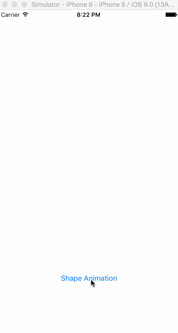

# CAShapeLayerTest

利用 PaintCode 生成复杂图形的 path，通过 CAShapeLayer 的 `strokeStart` 与 `strokeEnd` 属性实现动画效果。测试的效果如下：

更复杂更详细的教程请看：

- [How to build a nice Hamburger Button transition in Swift](http://robb.is/working-on/a-hamburger-button-transition/)
- [Animating the Drawing of a CGPath With CAShapeLayer](http://oleb.net/blog/2010/12/animating-drawing-of-cgpath-with-cashapelayer/)
